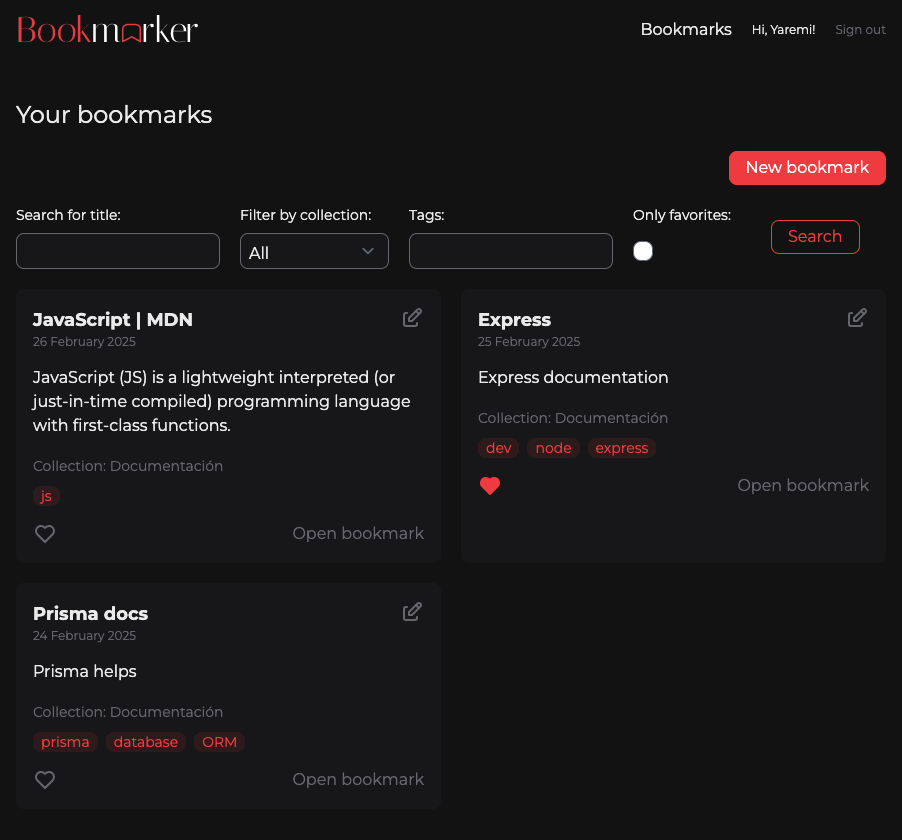
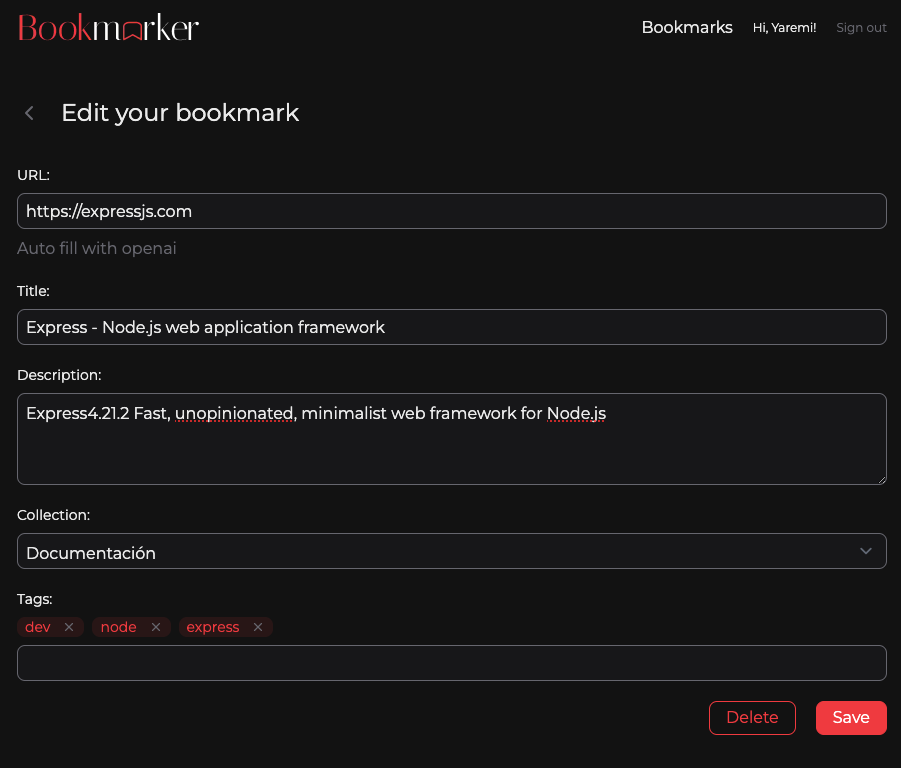

## Table of content

- [Description](#description)
- [Stack](#stack)
- [Prerequisites](#prerequisites)
- [Environment](#environment)
- [Building and running](#building-and-running)

## Description

App developed with Next.js to create and organize bookmarks, using openai to autocomplete forms.

<!--  -->
<div style="display:flex;gap:10px;flex-wrap:wrap;justify-content:center">



</div>

## Stack

- **[Required]** [Next.js](https://nextjs.org/docs)
- **[Required]** [Prisma](https://www.prisma.io/docs)
- **[Required]** [PostgreSQL](https://www.postgresql.org/docs/)
- **[Required]** [OpenAI](https://platform.openai.com/docs/overview)
- **[Required]** [Tailwindcss](https://tailwindcss.com/docs/installation/using-vite)
- **[Required]** [Next Auth](https://next-auth.js.org/getting-started/example)

## Prerequisites

- **[Required]** [Git](http://git-scm.com/)
- **[Required]** [NPM](https://npmjs.com)
- **[Required]** [Node.js](http://nodejs.org/)
- **[Required]** [Github app for auth](https://next-auth.js.org/providers/github)

## Environment

- **Localhost** http://localhost:3000

## Commands

All commands are run from the root of the project, from a terminal:

| Command        | Action                                      |
| :------------- | :------------------------------------------ |
| `npm install`  | Installs dependencies                       |
| `npm run dev`  | Starts local dev server at `localhost:3000` |
| `npm run lint` | Run eslint to find problems in the code     |

## Run app in your local

### First time setup

You must to have a file in the root, named **.env.local** with the next variables:

```
PORT=3000
AUTH_SECRET="YOUR_AUTH_SECRET"
AUTH_GITHUB_ID="YOUR_GITHUB_ID"
AUTH_GITHUB_SECRET="YOUR_GITHUB_SECRET"
DATABASE_URL="YOUR_POSTGRESQL_URL"
OPENAI_API_KEY="YOUR_OPENAI_API_KEY"
NODE_ENV=['development'|'production']

```

Then run the next commands:

```
  npm install
  npx prisma migrate dev --name init
```

### Run the application

```
  npm start
```

By default, the service is going to be exposed on `http://localhost:3000`.
